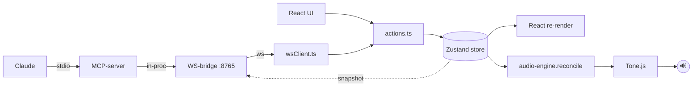

# Tonic — Fase 0 scaffold + docs (laagdrempelige web-DAW met MCP-bridge)

## Context

Bestaande web-DAW's zijn voor een leek overweldigend. We bouwen **Tonic**: een radicaal
eenvoudige web-DAW (React+TS+Vite, Tone.js, local-first) met een ingebouwde **MCP live-bridge**
zodat Claude de draaiende browser-app kan aansturen via dezelfde action-laag als de UI. Visueel
volgen we de SoundBlocks-stijl (skeuomorf, JetBrains Mono, knobs/faders).

**Scope van dít plan (bevestigd): alléén Fase 0 + de drie docs.** Geen bridge-logica en geen
verdere fases — die staan high-level in `ROADMAP.md` voor later. Doel van Fase 0: een runnende
scaffold met zichtbaar design-system en een geldige, ladende MCP-entry, als kleinste
review-bare eenheid.

**Bevindingen uit de repo (sturend voor dit plan):**
- `projects/racing-game` en `projects/home-manager` zijn **niet-geïnitialiseerde submodules**
  (`git submodule status` → `-`-prefix). De draft noemt racing-game als versie-baseline, maar die
  is **niet leesbaar** — versies worden hieronder dus expliciet vastgelegd, niet gekopieerd.
- Root `/.mcp.json` bestaat met lege `mcpServers: {}` — klaar voor een `tonic`-entry.
- Workspace-conventie (`/new-project`, `/update-docs`): **`ROADMAP.md` (hoofdletters)**, `todo.md`,
  `.env.example`/`.env.local`, `.claude/settings.json` met `CLAUDE_CODE_EXPERIMENTAL_AGENT_TEAMS=1`.
  → We gebruiken **`ROADMAP.md`** (gekozen) zodat `/update-docs` blijft matchen.
- Andere projecten (home-network, belastingaangifte) zijn gewone dirs in de hoofd-repo, maar
  racing-game en home-manager zijn juist **git-submodules**. **Beslissing (gekozen): Tonic krijgt
  een eigen GitHub-repo `https://github.com/e11en/Tonic` en wordt als git-submodule toegevoegd op
  `projects/tonic/`** — net als racing-game/home-manager. De Tonic-broncode leeft dus in de eigen
  repo; de hoofd-repo `home-workspace` pint enkel een commit-pointer via `.gitmodules`.
- Root `.claude/settings.json` staat al `Bash(npm:*)` en `Bash(git *)` toe.

**Stack-keuze: Vite blijft.** Vite is in 2026 niet achterhaald; SSR/RSC-meta-frameworks lossen
problemen op die een local-first browser-DAW niet heeft en botsen met `npm run dev`/local-first.
Optioneel later `rolldown-vite` als drop-in voor snellere builds. Pinned baseline:
**Vite 6+, React 18, TypeScript 5.x** (via `npm create vite@latest ... react-ts`).

## Architectuur (referentie voor de docs — pas in Fase 1 geïmplementeerd)

State is de enige bron van waarheid; UI en MCP-bridge zijn twee schrijvers via dezelfde
action-laag; de audio-engine is een pure reconciler/lezer.



**Twee correcties op de draft (belangrijk):**
1. `npm run dev` start **alleen Vite**. De stdio-MCP-server wordt door Claude Code gespawned via
   `.mcp.json`; de WS-bridge leeft ín dat proces. `concurrently` 'm óók laten starten geeft een
   tweede proces dat vecht om WS-poort 8765. Geen `concurrently` in de dev-flow.
2. Fase 0 levert een **minimale, ladende mcp-stub** (stdio + één `ping`-tool, géén WS), zodat de
   `.mcp.json`-entry geldig is en bij herstart cleanly laadt. WS-bridge + echte tools = Fase 1.

## Te creëren bestanden (Fase 0)

### 0. Git-submodule setup (EERST)
Tonic wordt als git-submodule toegevoegd op `projects/tonic/`, gekoppeld aan de eigen repo
`https://github.com/e11en/Tonic`. Concreet:
1. De GitHub-repo `e11en/Tonic` bestaat al en is leeg (bevestigd) — geen aanmaakstap nodig.
2. Voeg de submodule toe vanaf de root van `home-workspace`:
   ```bash
   git submodule add git@github.com:e11en/Tonic.git projects/tonic
   ```
   Dit schrijft de mapping naar `.gitmodules` (SSH zoals `origin` van home-workspace).
3. Bouw alle Fase 0-bestanden (docs + scaffold + mcp-stub) **binnen** `projects/tonic/`, commit en
   push die in de **Tonic-submodule** (eigen repo-historie).
4. Commit in de **hoofd-repo** de bijgewerkte `.gitmodules` + de submodule-pointer.

> Volgorde-noot: als `projects/tonic/` al lokale bestanden bevat (bv. dit `ultraplan.md` of een
> eerder aangemaakte `package.json`), die eerst veiligstellen/verplaatsen want `git submodule add`
> wil een lege of niet-bestaande doelmap. Daarna terugzetten en in de submodule committen.
> De root `/.mcp.json`-entry blijft in de **hoofd-repo** staan (verwijst naar een pad binnen de
> submodule) — niet in de Tonic-repo zelf.

### 1. Docs (in `projects/tonic/`)
- **`CLAUDE.md`** — wat Tonic is, architectuur-samenvatting (incl. de twee correcties hierboven),
  tech-stack (Vite/React/TS/Tone.js/Zustand, local-first), dev-instructies, en de
  **documentatie-workflow-regel**: `ROADMAP.md` = high-level fases; bij oppakken → stappen
  uitschrijven in `todo.md` (`- [ ]`); afvinken tijdens uitvoering; bij afronden → fase markeren
  in `ROADMAP.md`, `todo.md` legen en vullen met de volgende fase. Vermeld dat dit een striktere
  variant is van de workspace doc-hiërarchie. Code/docs in Engels, communicatie Nederlands.
- **`ROADMAP.md`** — alle 10 fases (0 t/m 9) high-level met statusindicator, Fase 0 als enige
  "in uitvoering". Volgt het workspace-format (`# Roadmap — Tonic`, statusregel, fases met
  korte beschrijving). MCP-bridge bewust naar voren in Fase 1.
- **`todo.md`** — gevuld met de concrete, afvinkbare Fase 0-stappen (de scaffold-checklist).

### 2. Scaffold (app)
- `index.html`, `package.json`, `vite.config.ts`, `tsconfig.json` (+ `tsconfig.node.json`).
  Path-aliases `@/` → `src/` en `@shared/` → `shared/` in zowel `vite.config.ts` als tsconfig.
- `.env.example` (placeholder, bv. WS-poort), leun op root `.gitignore` (node_modules al genegeerd).
- `.claude/settings.json` — kopie van het workspace-patroon (npm/git permissions + AGENT_TEAMS env).
- `src/main.tsx`, `src/App.tsx` (rendert `AppShell`).

### 3. SoundBlocks design-system (UI-shells)
> Er staat **geen SoundBlocks-bron in de repo**. Aanname: we **recreëren** de look (JetBrains Mono,
> skeuomorfe knobs/faders, panel-texturen) from scratch als shells. Als er een echte SoundBlocks-repo
> is om uit te kopiëren, moet die aangewezen worden — anders gaan we met de recreatie verder.

- `src/ui/tokens.css` — JetBrains Mono (npm `@fontsource/jetbrains-mono`), palette, panel-texturen,
  CSS custom properties.
- `src/ui/` shells: `Knob.tsx`, `Fader.tsx`, `Toggle.tsx`, `Button.tsx`, `Panel.tsx`, `LED.tsx`,
  `Help.tsx` — visueel werkend, props-gestuurd, nog niet aan state gekoppeld.
- `src/components/AppShell.tsx` — statische layout die minstens één Knob, Fader, Toggle en Panel
  toont (voor de Fase 0-verificatie).

### 4. State-skeletten (nog geen mutatie-logica)
- `src/state/types.ts` — kerntypes: `Project{tempo,tracks[],samples}`,
  `Track{kind,volumeDb,pan,muted,clips[],effects[],instrument?,drumKit?}`, `Clip`, `Note`,
  `Effect`, `SampleMeta`.
- `src/state/store.ts` — Zustand **vanilla** store (`createStore`) + `immer` +
  `subscribeWithSelector`, met een lege/initiële `Project`. Nog geen `actions.ts` (Fase 1).
- `shared/protocol.ts` — placeholder wire-types (zodat de `@shared`-alias werkt; gevuld in Fase 1).

### 5. MCP-stub (`projects/tonic/mcp-server/`)
- `package.json` met deps `@modelcontextprotocol/sdk`, `zod`, devdep `tsx`.
- `tsconfig.json`.
- `src/index.ts` — `McpServer` + `StdioServerTransport`, één `ping`-tool die `"tonic alive"`
  teruggeeft. **Alleen `console.error` loggen** (stdout = MCP-kanaal). Geen WS in Fase 0.

### 6. Root `/.mcp.json` registratie
Voeg de `tonic`-entry toe (run-via-tsx zodat geen build-stap nodig is):
```json
{
  "mcpServers": {
    "tonic": {
      "command": "npx",
      "args": ["-y", "tsx", "projects/tonic/mcp-server/src/index.ts"]
    }
  }
}
```
> `npx -y tsx` resolvet tsx uit de lokale `mcp-server/node_modules` of haalt 'm op. Implementer
> moet ná herstart bevestigen dat de server laadt (zie verificatie). Alternatief als dit hapert:
> compileren naar JS en met `node` draaien — alleen doen als de tsx-route faalt.

## Aanbevolen deps (Fase 0-subset)
App: `react`, `react-dom`, `zustand`(+`immer`), `@fontsource/jetbrains-mono`, dev: `vite`,
`@vitejs/plugin-react`, `typescript`, `@types/*`. (`tone`, `idb`, `nanoid`, `ws` etc. komen pas
wanneer hun fase begint.) MCP-server: `@modelcontextprotocol/sdk`, `zod`, dev `tsx`,
`typescript`.

## Volgorde van uitvoering
0. **Git-submodule** `projects/tonic/` → `git@github.com:e11en/Tonic.git` opzetten (zie sectie 0).
1. Docs eerst (`CLAUDE.md`, `ROADMAP.md`, `todo.md`) — leggen de workflow vast.
2. App-scaffold + tokens + UI-shells + AppShell → `npm run dev` moet draaien en het design-system
   tonen.
3. State-skeletten + `shared/protocol.ts` placeholder.
4. MCP-stub + root `/.mcp.json`-entry.

## Verificatie (Fase 0)
0. `git submodule status` toont `projects/tonic` als geïnitialiseerde submodule; `.gitmodules`
   bevat de `e11en/Tonic`-mapping; de Fase 0-commit staat in de Tonic-repo.
1. `cd projects/tonic && npm install` en `npm install --prefix mcp-server` slagen zonder fouten.
2. `npm run dev` start Vite zonder fouten; de app toont de `AppShell` met JetBrains Mono en een
   zichtbare knob + fader + toggle + panel (SoundBlocks-look).
3. Root `/.mcp.json` bevat de `tonic`-entry. **Herstart Claude Code** → de `tonic` MCP-server
   laadt en de `ping`-tool verschijnt; `ping` aanroepen geeft `"tonic alive"`.
4. **Browser-visuele check via de Claude-in-Chrome extensie** (geen Playwright) van het
   design-system.

## Bewust uitgesteld naar latere fases (niet in dit plan)
`src/state/actions.ts` (enige mutatielaag), `src/audio/engine.ts` (reconciler), de WS-bridge +
`bridge.ts`/`tools.ts`, `src/bridge/wsClient.ts`, persistence (IndexedDB), en alle feature-fases
(samples, opname, instrumenten/piano roll, drum machine, effecten, Web MIDI, beginner-polish).
Deze staan high-level in `ROADMAP.md`.
